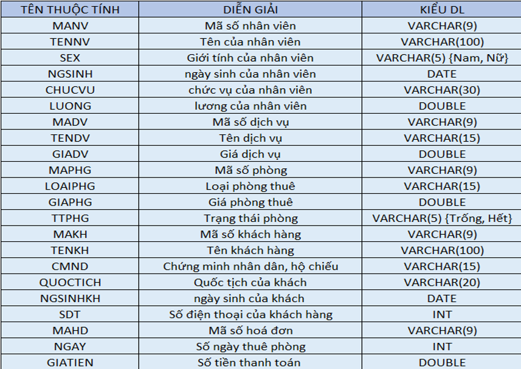
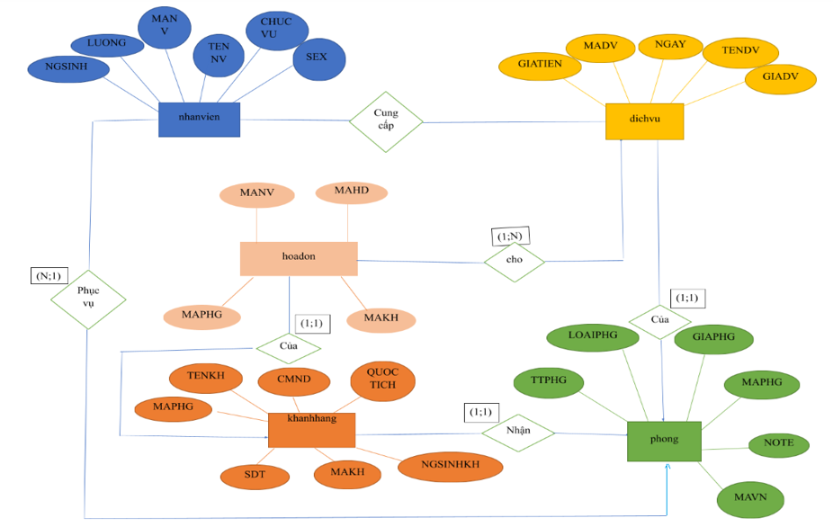
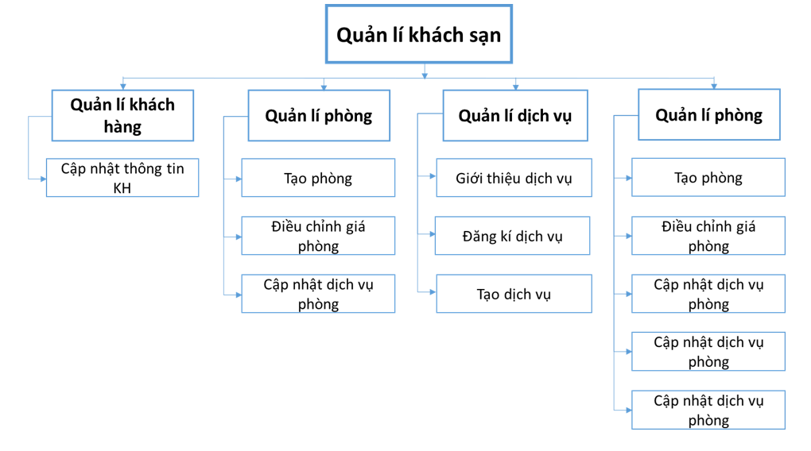
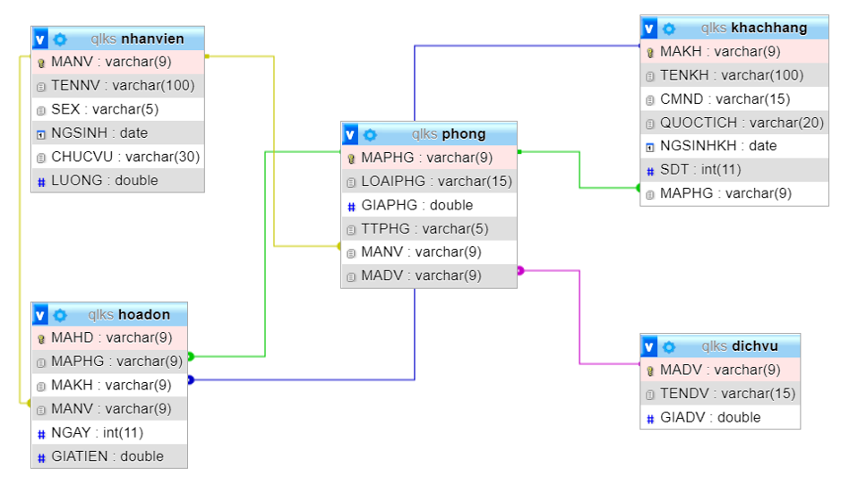

## Cơ sở dữ liệu quản lý khách sạn
# Đối tượng cần quản lý là thông tin về tất cả các khách hàng và một số các thông tin khác của các bộ phận thuộc khách sạn bao gồm:
Quản lý thông tin khách hàng
Quản lý thông tin nhân viên
Quản lý thông tin phòng
Quản lý dịch vụ
Quản lý hoá đơn thanh toán 

## Bảng mô tả thuộc tính 

## Sơ đồ thực thể liên kết 

## Lược đồ phân cấp chức năng hệ thống 

## Lược đồ quan hệ CSDL  quản lý khách sạn

